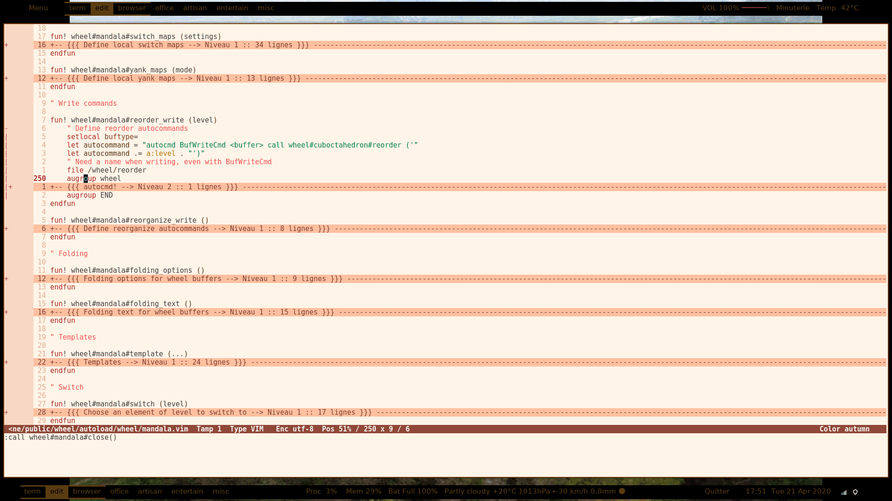

<!-- vim: set filetype=markdown: -->

<!-- vim-markdown-toc GFM -->

* [Introduction](#introduction)
	* [What does it look like ?](#what-does-it-look-like-)
		* [Main menu](#main-menu)
		* [More screenshots](#more-screenshots)
	* [Buffer groups & categories](#buffer-groups--categories)
		* [Why do you need three levels of grouping ?](#why-do-you-need-three-levels-of-grouping-)
		* [A wheel that follows you](#a-wheel-that-follows-you)
	* [Features](#features)
	* [History](#history)
* [Installation](#installation)
	* [Using minpac](#using-minpac)
	* [Using plug](#using-plug)
* [Configuration](#configuration)
* [Step by Step](#step-by-step)
	* [Documentation](#documentation)
	* [One map to ring them all](#one-map-to-ring-them-all)
	* [Mnemonic](#mnemonic)
	* [First Circles](#first-circles)
	* [Moving around](#moving-around)
		* [Cycling](#cycling)
		* [Switch using completion](#switch-using-completion)
		* [Switch using a special buffer](#switch-using-a-special-buffer)
	* [Square the Circle](#square-the-circle)
* [Warning](#warning)
* [Licence](#licence)

<!-- vim-markdown-toc -->

# Introduction

Wheel is a navigation plugin for Vim and Neovim. It is buffer group
oriented and makes abundant use of special buffers, in which you can
filter and select elements.

## What does it look like ?

### Main menu



### More screenshots

[It’s here](screenshots.md)

## Buffer groups & categories

Wheel let you organize your buffers by creating as many buffer groups as
you need, add the buffers you want to it and quickly navigate between :

- Buffers of the same group
- Buffer groups

Note that :

- A location contains a name, a filename, as well as a line & column number
- A buffer group, in fact a location group, is called a circle
- A set of buffer groups, or a category, is called a torus (a circle of circles)
- The list of toruses is called the wheel

### Why do you need three levels of grouping ?

At first glance, managing groups with circles in a torus seems to be
sufficient. But with time, the torus grows big, and a third level helps
you to organize your files by groups and categories:

- The wheel contains all the toruses
- Each torus contains a category of files, e.g.:
  + configuration, development, publication
- Each circle contains a project, e.g.:
  + emacs or vifm circles in configuration torus
  + shell or elisp in development torus
  + tea or art in publication torus

### A wheel that follows you

Wheel is designed to follow your workflow : you only add the files
you want, where you want. For instance, if you have a `organize` group
with agenda & todo files, you can quickly alternate them, or display
them in two windows. Then, if you suddenly got an idea to tune vim,
you switch to the `vim` group with your favorites configuration files in
it. Same process, to cycle, alternate or display the files. Over time,
your groups will grow and adapt to your style.

## Features

- Add
  + Files from anywhere in the filesystem
  + A file in more than one group
  + file:line-1 and file:line-2 in the same group
- May be saved in wheel file (recommended)
- On demand loading of files
  + No slowdown of (neo)vim start
- Easy navigation
  + Switch to matching tab & window if available
  + Next / Previous location, circle or torus
  + Choose file, group or category in special buffer
    * Filter candidates
    * Folds matching wheel tree structure
    * Context menus
  + Auto |:lcd| to project root of current file
- Search files
  + Opened buffers
  + Visible buffers in tabs & wins
  + MRU files not found in wheel
  + Using locate
  + Using find
- Search inside files
  + Grep on group files
    * Navigate
    * Edit buffer and propagate changes
  + Outline
    * Folds headers in group files (based on fold markers)
    * Markdown headers
    * Org mode headers
  + Tags
  + Jumps & changes lists
- Yank wheel using TextYankPost event
- Reorganizing elements
- Special buffers stack to save your searches
- Display files
  + Split levels : torus, circle, location
  + Split
    * vertical, golden vertical
    * horizontal, golden horizontal
    * main left, golden left
    * main top, golden top
    * grid
  + Mix of above
    * circles on tabs, locations on split
    * toruses on tabs, circles on split
- Batch operations
- Autogroup files by extension or directory

As you see, the group manager is the core, but it goes far beyond that :
you need a quick navigation framework to travel in the wheel, and once
it is there, it’s easy to add new functionalities.

UNIX’s philosophy is respected however, on a module level : each file in
`autoload/wheel` deals with a specific kind of problem, and do it well ;
the magic is when modules talk together.

## History

This project is inspired by :

- [CtrlSpace](https://github.com/vim-ctrlspace/vim-ctrlspace), a workspace
plugin for Vim

- [Unite](https://github.com/Shougo/unite.vim) and its successor
[Denite](https://github.com/Shougo/denite.nvim), a search plugin for
arbitrary sources

- [Torus](https://github.com/chimay/torus), a similar plugin for Emacs,
itself inspired by MTorus

# Installation

## Using minpac

Simply add this line to your initialisation file :

```vim
call minpac#add('chimay/wheel', { 'type' : 'start' })
```

and it’s done.

## Using plug

The syntax should be similar with other git oriented plugin managers :

```vim
Plug 'chimay/wheel'
```

# Configuration

Here is an example of configuration :

```vim
if ! exists("g:wheel_loaded")

  " Init
  let g:wheel_config={}
  let g:wheel_config.maxim={}

  " The file where toruses and circles will be stored and read
  let g:wheel_config.file = '~/.local/share/wheel/auto.vim'
  " Auto read torus file on startup if > 0
  let g:wheel_config.autoread = 1
  " Auto write torus file on exit if > 0
  let g:wheel_config.autowrite = 1
  " Number of backups for the wheel file
  let g:wheel_config.backups = 5
  " The bigger it is, the more mappings available
  let g:wheel_config.mappings = 10
  " Prefix for mappings
  let g:wheel_config.prefix = '<M-w>'
  " Auto cd to project root if > 0
  let g:wheel_config.cd_project = 1
  " Marker of project root
  "let g:wheel_config.project_markers = '.git'
  "let g:wheel_config.project_markers = '.racine-projet'
  " List of markers
  " The project dir is found as soon as one marker is found in it
  let g:wheel_config.project_markers = ['.git', '.racine-projet']
  " Locate database ; default one if left empty
  let g:wheel_config.locate_db = '~/racine/index/locate/racine.db'

  " Maximum number of elements in history
  let g:wheel_config.maxim.history = 50
  " Maximum number of elements in input history
  let g:wheel_config.maxim.input = 100

  " Maximum number of elements in mru
  let g:wheel_config.maxim.mru = 120

  " Maximum number of elements in yank wheel
  let g:wheel_config.maxim.yanks = 300
  " Maximum size of elements in yank wheel
  let g:wheel_config.maxim.yank_size = 3000

  " Maximum number of tabs in layouts
  let g:wheel_config.maxim.tabs = 12
  " Maximum number of horizontal splits
  let g:wheel_config.maxim.horizontal = 3
  " Maximum number of vertical splits
  let g:wheel_config.maxim.vertical = 4

  " random ideas
  nmap <m-cr> <plug>(wheel-switch-location)
  nmap <c-cr> <plug>(wheel-switch-circle)
  nmap <s-cr> <plug>(wheel-switch-torus)

endif
```

as a starting point.

# Step by Step

## Documentation

[Your guide](https://github.com/chimay/wheel/blob/master/doc/wheel.txt)
on the wheel tracks :

```vim
 :help wheel.txt
 ```

## Prefix

In the following discussion, I assume that you have kept the default
mapping prefix :

```vim
let g:wheel_config.prefix = '<M-w>'
```

Just replace it by your prefix if you’ve changed it.

## One map to ring them all

To get an overview of the Wheel, I suggest you take a look at the main
menu. Press `<M-w>m` and a new buffer will appear, listing the actions
you can perform. Insert mode is used to filter the lines. Press enter
in normal mode to trigger an action (if you know what you’re doing),
or `q` to quit the menu.

If you prefer the meta menu leading you to thematic sub-menus, you can
launch it with `<M-w>=`.

## Mnemonic

Most mappings respect the following convention :

- prefix + `letter`     : location operation
- prefix + `<C-letter>` : circle operation
- prefix + `<S-letter>` : torus operation
- prefix + `<M-letter>` : alternative operation

## First Circles

Let’s say we have the files `Juice`, `Tea`, `Coffee` and we want to
group them. So, we go `Juice` and type `<M-w>a` to add a location to the
wheel. If no torus is present in the wheel, it will create it and ask
for a name. Let’s say we name it `Food`. If no group (no circle) is
found in the torus, it will be created and prompt for a name. Let’s say
we choose `Drinks`. Finally, our file `Juice` is added to the group. Its
name is the filename without extension by default.

Then, we go to `Tea` and type `<M-w>a` again. This time, it will just
ask us if we want to keep the default location name. Press enter, and
`Tea` is added to the `Drinks` group.

Same process with `Coffee`. We now have a circle `Drink` containing
three files.

If you want to create another circle, let’s say `Fruits`, simply launch
`<M-w><C-a>`, and answer `Fruits` to the prompt. You can then add the
files `Apple`, `Pear` and `Orange` to it. You can even also add `Juice`:
a file can be added to more than one circle.

Now, suppose that in the `Juice` file, you have a Pineapple
and a Mango sections, and you want to compare them. Just go to
the Pineapple section, and use `<M-w>a`. It will add the location
`Juice:pineapple-line:pineapple-col` to the current circle. Then, go to
the Mango section, and do the same. The `Juice:mango-line:mango-col`
will also be added to the circle. You can then easily alternate both,
or display them in split windows.

If you want to create another torus, let’s say `Books`, simply launch
`<M-w><S-a>`, and answer `Books` to the prompt.

## Moving around

### Cycling

You can cycle the files of a circle with `<M-w><Left>` and
`<M-w><Right>`. These are often used bindings, so I suggest you map them
to more convenient keys, like `<C-PageUp>` and `<C-PageDown>`

To cycle the circles, use `<M-w><C-Left>` and `<M-w><C-Right>`. You can
also map them to more convenient keys, like `<C-Home>` and `<C-End>`.

To cycle the toruses, use `<M-w><S-Left>` and `<M-w><S-Right>` or
map them to `<S-Home>` and `<S-End>`.

### Switch using completion

You can also switch location by completion with `<M-w><CR>`.

You can also switch circle by completion with `<M-w><C-CR>`.

You can also switch torus by completion with `<M-w><S-CR>`.

### Switch using a special buffer

You can also switch location by chosing it in a special buffer. The
default mapping is `<M-w><Space>`. Pressing enter on a line will switch
to the matching location. Going to insert mode will allow you to filter
the lines with one or more words.

To choose a given circle in a special buffer, use `<M-w><C-space>`.

To choose a given torus in a special buffer, use `<M-w><S-space>`.

## Square the Circle

Over time, the number of circles will grow. Completion is great, but
if you just want to alternate the two last circles in history, you’ll
probably prefer `<M-w>^`.

If you press `<M-w><C-^>`, you can choose the alternate mode in a menu :

- Alternate anywhere
- Alternate in the same circle
- Alternate in the same torus
- Alternate in another circle
- Alternate in another torus
- Alternate in same torus but another circle

A common case is to alternate two files in the same circle, and two
circles in the same torus. So, you have the square :

 Alternate    | File 1	        | File 2
--------------|-----------------|-----------------
Circle Drinks | Juice           | Tea
Circle Fruits | Apple           | Pear

at your fingertips.

# Warning

Despite abundant testing, some bugs might remain, so be careful.

# Licence

MIT
