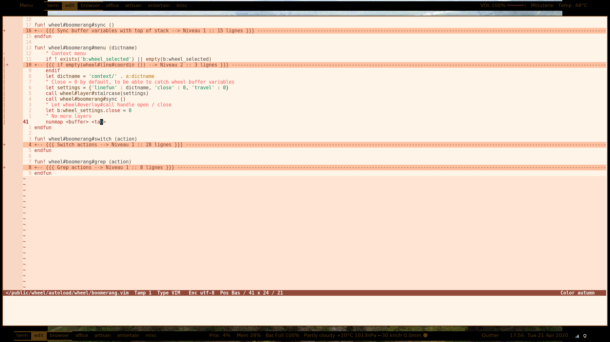
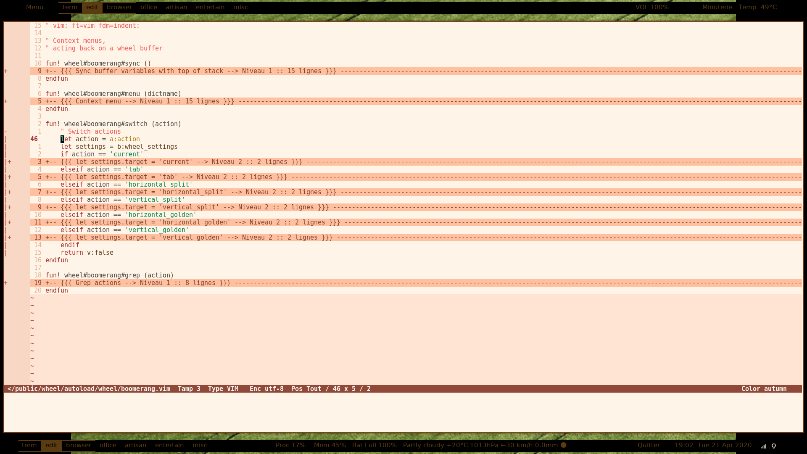
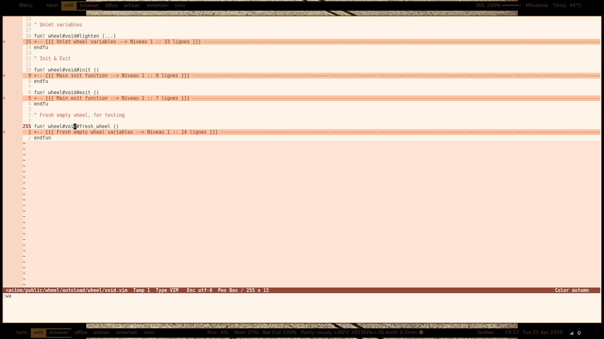
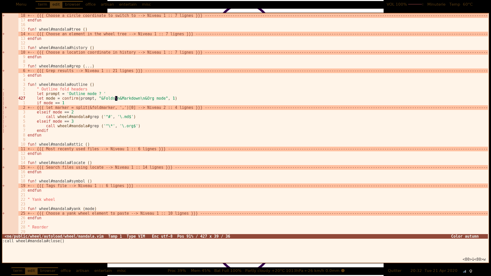
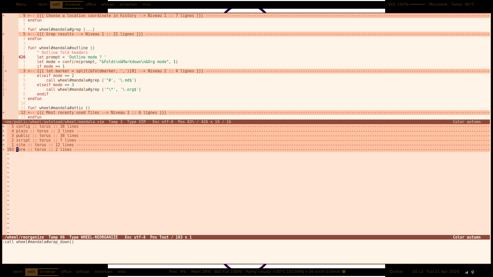
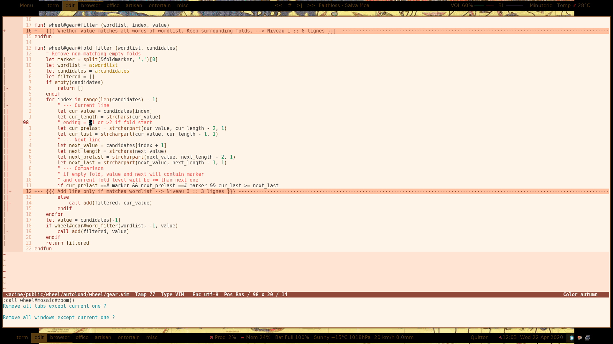
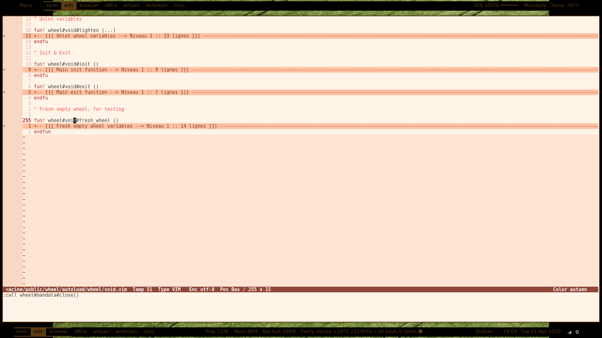
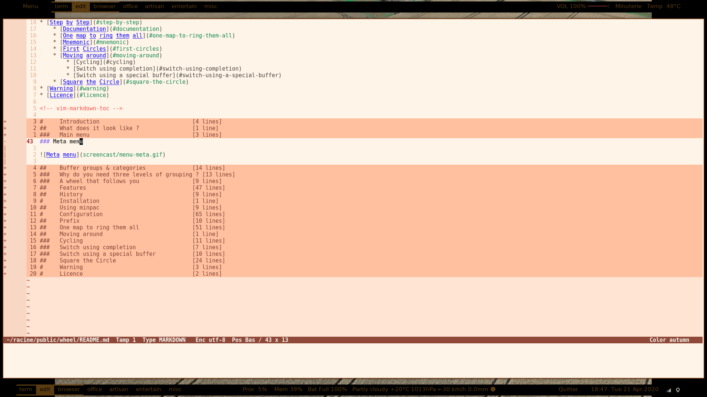
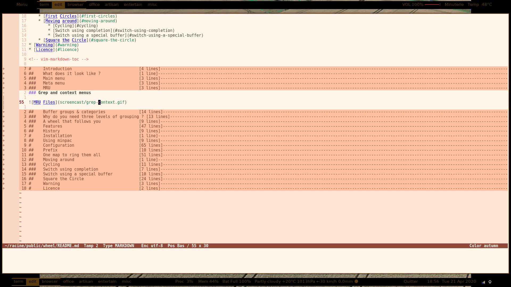
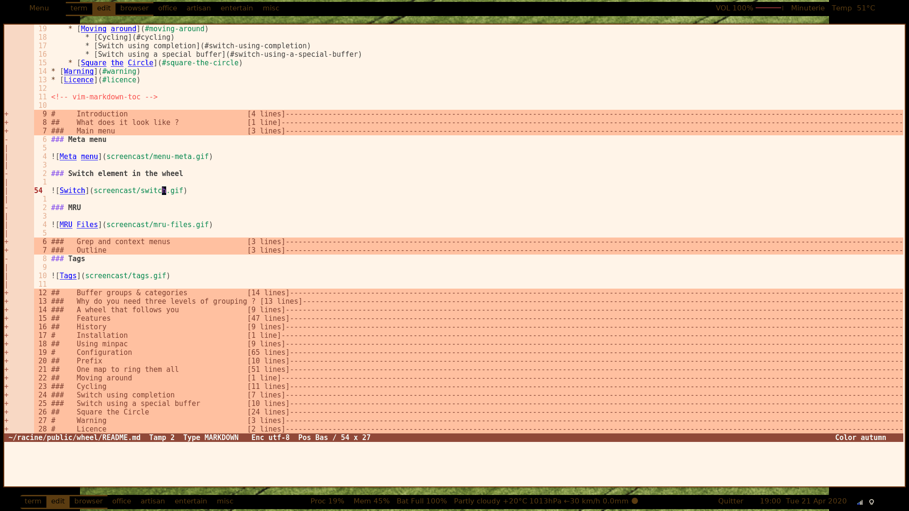

<!-- vim: set filetype=markdown: -->

<!-- vim-markdown-toc GFM -->

* [Meta menu](#meta-menu)
* [Switch element in the wheel](#switch-element-in-the-wheel)
* [Tree view](#tree-view)
* [Reordering](#reordering)
* [Reorganizing](#reorganizing)
* [Layouts](#layouts)
* [History](#history)
* [MRU](#mru)
* [Grep and context menus](#grep-and-context-menus)
* [Outline](#outline)
* [Tags](#tags)

<!-- vim-markdown-toc -->

### Meta menu

### Switch element in the wheel

### Tree view

### Reordering

### Reorganizing

### Layouts

### History

### MRU

### Grep and context menus

### Outline

### Tags

